# Olá, eu sou o Lucas 👋

🎓 Estudante de **Análise e Desenvolvimento de Sistemas (ADS)**  
💻 Desenvolvedor em formação com interesse em **Web, Mobile e Back-end**  
🚀 Aprendo e evoluo criando projetos, estudando e experimentando novas tecnologias.

---

## 👨‍💻 Sobre mim

- 🎓 Cursando **Análise e Desenvolvimento de Sistemas**
- 💻 Tenho interesse em desenvolvimento **Web, Mobile e Back-end**
- 🗄️ Tenho conhecimento em **PostgreSQL** e familiaridade com **Firebase**
- 🤖 Explorando aplicações com **Inteligência Artificial**
- 🧪 Estudando práticas como **TDD, BDD e CI/CD**
- 🔀 Utilizo **Git e GitHub** para versionamento e colaboração
- 🚀 Desenvolvo projetos acadêmicos e pessoais para aprimorar minhas habilidades
- 📚 Estou sempre aprendendo novas tecnologias e boas práticas

---

## 🛠️ Tecnologias e ferramentas

### Front-end

### Mobile

### Back-end

### Banco de dados

### Ferramentas e práticas

---

## 📚 Atualmente estudando

- Desenvolvimento de aplicações Web e Mobile
- APIs REST e comunicação entre front-end e back-end
- Arquitetura de software e bancos de dados
- Git, GitHub e CI/CD
- TDD e BDD
- Inteligência Artificial aplicada a sistemas
- Boas práticas de desenvolvimento

---

## 📊 Estatísticas do GitHub

  
  

---

## 📫 Contato

---

### 🚀 Sempre aprendendo, construindo e evoluindo como desenvolvedor.
